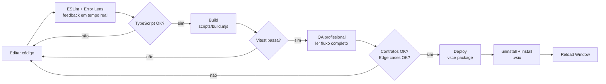

# Hermes Agent — Guia de Produtividade Máxima

> Como retornar ao estado atual de conhecimento do projeto com todas as
> extensões integradas para máxima produtividade e assertividade.

## Índice

1. [Restauração do Conhecimento do Projeto](#1-restauração-do-conhecimento-do-projeto)
2. [Extensões Instaladas e Integração](#2-extensões-instaladas-e-integração)
3. [Configuração do Workspace (.vscode/settings.json)](#3-configuração-do-workspace)
4. [Fluxo de Trabalho (Build → Test → QA → Deploy)](#4-fluxo-de-trabalho)
5. [Referência Rápida de Comandos](#5-referência-rápida-de-comandos)
6. [QA Checklist](#6-qa-checklist)
7. [Troubleshooting Comum](#7-troubleshooting-comum)

---

## 1. Restauração do Conhecimento do Projeto

### 1.1 Reabsorver as Regras

Sempre iniciar um novo prompt reabsorvendo o `AGENTS.md`:

```text
AGENTS.md contém as REGRAS INEGOCIÁVEIS do projeto.
```

### 1.2 Arquivos Essenciais para Ler

| Arquivo                 | Propósito                                                                      |
| ----------------------- | ------------------------------------------------------------------------------ |
| `AGENTS.md`             | Regras inegociáveis do projeto (deploy a cada alteração, QA antes de entregar) |
| `PROGRESS.md`           | Estado atual, bugs corrigidos, próximos passos                                 |
| `README.md`             | Visão geral, quick start, arquitetura                                          |
| `docs/ARCHITECTURE.md`  | Diagrama de processo e componentes detalhados                                  |
| `package.json`          | Dependências, comandos, contribuições                                          |
| `.vscode/settings.json` | Configurações otimizadas do workspace                                          |

### 1.3 Arquitetura em 30 Segundos

```text
┌──────────────────────────────────────────────────────┐
│  VS Code Extension Host (Node 20, esbuild CJS)       │
│  ┌──────────┐  postMessage  ┌──────────────────────┐ │
│  │ Extension│ ◄──────────►  │ Webview (React+Vite) │ │
│  │ Host     │               │ - ChatView (6 tabs)  │ │
│  │ Services │  JSON-RPC 2.0 │ - CascadeFlow        │ │
│  └────┬─────┘  over stdio   │ - Onboarding Wizard  │ │
│       │                     └──────────────────────┘ │
│       ▼                                               │
│  ┌────────────────────────────────────────┐           │
│  │  Hermes ACP (Python, hermes acp)       │           │
│  │  - AIAgent core, MCP, Skills, Memory   │           │
│  │  - Multi-provider (NVIDIA, OpenAI...)  │           │
│  └────────────────────────────────────────┘           │
└──────────────────────────────────────────────────────┘
```

- **Host** (TypeScript estrito, esbuild → `dist/extension.js`)
- **Webview** (React 18 + Vite + ESM → `dist-webview/`)
- **ACP**: comunicação bidirecional JSON-RPC 2.0 via stdio com processo Python

---

## 2. Extensões Instaladas e Integração

### 2.1 Extensões Essenciais para o Projeto

#### Tier 1 — Críticas (instaladas e integradas)

| Extensão                | ID                                      | Função                      | Integração no Projeto                                                                                                                                                                                                        |
| ----------------------- | --------------------------------------- | --------------------------- | ---------------------------------------------------------------------------------------------------------------------------------------------------------------------------------------------------------------------------- |
| **TypeScript Next**     | `ms-vscode.vscode-typescript-next`      | Versão nightly do TS        | Usa `typescript.tsdk` do workspace. Ativado via `"typescript.nightly.enable": true` no settings.json. Permite testar features futuras do TS.                                                                                 |
| **Vitest Explorer**     | `vitest.explorer`                       | UI dedicada para testes     | Lê `vitest.config.ts` automaticamente. Mostra testes no painel "Testes" com run/debug. Configurado com `"vitest.rootPath": "${workspaceFolder}"`.                                                                            |
| **Jest Runner**         | `firsttris.vscode-jest-runner`          | Run/debug testes no code    | Configurado para usar Vitest: `"jestrunner.jestCommand": "npx vitest"`. Run inline no código via CodeLens ou atalho.                                                                                                         |
| **Todo Tree**           | `gruntfuggly.todo-tree`                 | Indexação de TODO/FIXME     | **Consultado pelo Copilot como contexto de prioridade**. Tags: TODO, FIXME, HACK, BUG, NOTE, OPTIMIZE. Exclui node_modules/dist. Mostra badges e contagem na status bar. **No startup**: abrir painel e ler TODOs pendentes. |
| **Error Lens**          | `usernamehw.errorlens`                  | Erros inline no código      | Mostra erros/warnings ao lado da linha. Configurado para exibir sempre, inclusive no save.                                                                                                                                   |
| **Mermaid Chart**       | `mermaidchart.vscode-mermaid-chart`     | Visualização de diagramas   | Preview e export de diagramas Mermaid. Use após validar com o Mermaid Diagram Validator embutido.                                                                                                                            |
| **Markdown Mermaid**    | `bierner.markdown-mermaid`              | Mermaid em preview Markdown | Renderiza blocos ```mermaid em arquivos .md. Ativado via `"markdown.preview.markdownMermaid": true`.                                                                                                                         |
| **Prettier**            | `esbenb.prettier-vscode`                | Formatador de código        | Default formatter. Config: single quote, trailing commas, printWidth 100, tab 2. Requer config na raiz.                                                                                                                      |
| **ESLint**              | `dbaeumer.vscode-eslint`                | Lint TypeScript             | Valida .ts e .tsx. Run on type. Integrado com o build (esbuild faz lint também).                                                                                                                                             |
| **YAML**                | `redhat.vscode-yaml`                    | Schema validation YAML      | Valida `config.yaml` do Hermes contra schema. Autocomplete habilitado.                                                                                                                                                       |
| **Code Spell Checker**  | `streetsidesoftware.code-spell-checker` | Correção ortográfica        | Dicionário en+pt_BR. Palavras do projeto (ACP, MCP, Hermes, etc.) pré-adicionadas.                                                                                                                                           |
| **DotENV**              | `mikestead.dotenv`                      | Syntax highlight .env       | Mapeado para `.env*`, `.env.local`, `.env.production`.                                                                                                                                                                       |
| **GitLens**             | `eamodio.gitlens`                       | Git superpoderes            | CodeLens com blame, history inline, explorador de repositório.                                                                                                                                                               |
| **Git Graph**           | `mhutchie.git-graph`                    | Visualização de branches    | Gráfico Git interativo.                                                                                                                                                                                                      |
| **Better Comments**     | `aaron-bond.better-comments`            | Comentários coloridos       | Categorias: ! (alert), ? (question), todo (laranja), \* (highlight), NOTE, OPTIMIZE.                                                                                                                                         |
| **npm Intellisense**    | `christian-kohler.npm-intellisense`     | Autocomplete de imports     | Scan de devDependencies. Aspas simples.                                                                                                                                                                                      |
| **Markdown All in One** | `yzhang.markdown-all-in-one`            | Edição Markdown             | TOC automático (níveis 2-4), auto-preview, atalhos.                                                                                                                                                                          |
| **markdownlint**        | `davidanson.vscode-markdownlint`        | Lint Markdown               | Garante consistência em docs .md.                                                                                                                                                                                            |

### 2.2 Extensões de Apoio

| Extensão              | ID                                   | Quando Usar                            |
| --------------------- | ------------------------------------ | -------------------------------------- |
| **Path Intellisense** | `christian-kohler.path-intellisense` | Autocomplete de caminhos em imports    |
| **Auto Close Tag**    | `formulahendry.auto-close-tag`       | Fechamento automático de tags HTML/JSX |
| **Auto Rename Tag**   | `formulahendry.auto-rename-tag`      | Renomear tag HTML/JSX sincronizado     |
| **Indent Rainbow**    | `oderwat.indent-rainbow`             | Indentação colorida (4 espaços)        |
| **Rainbow CSV**       | `mechatroner.rainbow-csv`            | Visualização de CSV                    |
| **Bookmarks**         | `alefragnani.bookmarks`              | Marcadores de linha                    |
| **EditorConfig**      | `editorconfig.editorconfig`          | Consistência entre editores            |

---

## 2.3 MCP Servers Integrados (6 servidores)

Instalados em 2026-06-13 via `hermes mcp add`. Ativados automaticamente em toda sessão do Hermes ACP.
Config stored in `C:\Users\Usuario\AppData\Local\hermes\config.yaml` (seção `mcp_servers:`).

### 2.3.1 Tabela de Servidores

| Servidor                | Tools                                                   | Função Principal                                                   | Config                                                     |
| :---------------------- | :------------------------------------------------------ | :----------------------------------------------------------------- | :--------------------------------------------------------- |
| **sequential-thinking** | `sequential_thinking`                                   | Raciocínio estruturado passo-a-passo com revisões e ramificações   | `node dist/index.js` (stdlib)                              |
| **filesystem**          | 13 tools: read, write, edit, search, tree, move, info   | Acesso completo ao sistema de arquivos (escopo: `E:\Hermes agent`) | `node dist/index.js E:\Hermes agent`                       |
| **github**              | 22 tools: issues, PRs, commits, search, files, branches | Integração total com GitHub API (requer `GITHUB_TOKEN`)            | `node dist/index.js` + env `GITHUB_TOKEN`                  |
| **memory**              | 8 tools: entities, relations, search, graph             | Grafo de conhecimento persistente entre sessões                    | `node dist/index.js` (stdlib, arquivo `memory.jsonl`)      |
| **puppeteer**           | 7 tools: navigate, screenshot, click, fill, evaluate    | Automação de navegador Chrome headless                             | `node dist/index.js` (stdlib)                              |
| **fetch-url**           | `fetch-url`                                             | Fetch de páginas web → Markdown limpo                              | `node dist/index.js` (stdlib, via `@j0hanz/fetch-url-mcp`) |

### 2.3.2 Guia de Uso — Quando Usar Cada MCP

#### 🤔 Raciocínio e Planejamento

- **sequential-thinking**: debugging de fluxos complexos (webview → store → extension → ACP), análise de problemas de build/deploy, planejamento arquitetural com revisão incremental
- **memory**: salvar preferências do usuário entre sessões, documentar relações entre componentes, armazenar decisões de arquitetura

#### 📂 Manipulação de Arquivos

- **filesystem**: ler logs do ACP (`read_text_file`), editar configs (`edit_file`), navegar na árvore do projeto (`directory_tree`), buscar arquivos (`search_files`)
- **filesystem**: criar novos arquivos/diretórios no workspace (`write_file`, `create_directory`)
- **filesystem**: obter metadados de arquivos (`get_file_info`), mover/renomear (`move_file`)

#### 🌐 Integração GitHub

- **github**: criar/gerenciar issues (`create_issue`, `list_issues`, `update_issue`)
- **github**: criar PRs e revisar código (`create_pull_request`, `merge_pull_request`, `create_pull_request_review`)
- **github**: buscar código e repositórios (`search_code`, `search_repositories`, `get_file_contents`)
- **github**: criar branches e fazer push (`create_branch`, `push_files`, `create_or_update_file`)

#### 🧪 Teste e Automação de UI

- **puppeteer**: testar renderização do webview React (`puppeteer_navigate`, `puppeteer_screenshot`)
- **puppeteer**: preencher formulários e testar interações (`puppeteer_fill`, `puppeteer_click`)
- **puppeteer**: executar JavaScript no contexto do navegador (`puppeteer_evaluate`)
- **puppeteer**: capturar screenshots para depuração visual

#### 🌍 Busca Web

- **fetch-url**: buscar documentação online, APIs públicas, páginas de referência
- **fetch-url**: converter HTML para Markdown limpo

### 2.3.3 Notas de Setup

| Servidor       | Especificidades                                                                                                                                                      |
| :------------- | :------------------------------------------------------------------------------------------------------------------------------------------------------------------- |
| **filesystem** | Escopo restrito a `E:\Hermes agent`. Não consegue ler fora desse diretório.                                                                                          |
| **github**     | Requer `GITHUB_TOKEN` configurado no ambiente. Se não estiver setado, tools retornam erro de autenticação.                                                           |
| **puppeteer**  | Usa Chrome headless embutido. Opcional: configurar `PUPPETEER_LAUNCH_OPTIONS` env var para Chrome customizado. `allowDangerous=true` necessário para `--no-sandbox`. |
| **memory**     | Persiste dados em `memory.jsonl` no diretório do servidor. Opcional: `MEMORY_FILE_PATH` para caminho customizado.                                                    |

### 2.3.4 Solução de Problemas — Instalação

Se um MCP parar de funcionar, reinstalar com o padrão:

```powershell
# 1. Pré-instalar o pacote npm globalmente
npm install -g @modelcontextprotocol/server-<name>

# 2. Adicionar ao Hermes via caminho direto do node (não usar npx)
& "C:\Users\Usuario\AppData\Local\hermes\hermes-agent\venv\Scripts\hermes.exe" mcp add <name> --command node --args C:\nvm4w\nodejs\node_modules\@modelcontextprotocol\server-<name>\dist\index.js --args <args-adicionais>

# 3. Paths disponíveis:
#    - C:\nvm4w\nodejs\node_modules\ (junction nvm4w)
#    - C:\Users\Usuario\AppData\Local\nvm\v26.0.0\node_modules\ (path real)
```

> ⚠ **Nota importante**: `mcp add` pode falhar no teste de conexão para alguns servidores (ex: filesystem). Nesse caso, edite o `config.yaml` diretamente seguindo o formato dos servidores já configurados.

Context7 não foi instalado — requer API key paga.

---

## 3. Configuração do Workspace

### 3.1 `.vscode/settings.json`

Já criado na raiz. Destaques:

- **Format on save**: ativado com Prettier
- **TypeScript SDK**: aponta para `node_modules/typescript/lib`
- **Todo Tree**: tags customizadas com cores
- **Spell Checker**: dicionário en+pt_BR + palavras do projeto
- **Vitest**: configurado para rodar da raiz
- **Files associations**: `.env*` → dotenv, `config.yaml` → yaml

### 3.2 Extensões Recomendadas

O VS Code exibirá um popup sugerindo instalar extensões da seção `extensions.json`
(quando criado). Para ver as recomendações automaticamente, instale as extensões
listadas acima — o VS Code as gerencia via `extensions.ignoreRecommendations: false`.

---

## 4. Fluxo de Trabalho

### 4.1 Ciclo de Desenvolvimento



### 4.2 Build Completo

```powershell
cd "E:\Hermes agent"

# Build (host esbuild + webview vite)
node scripts/build.mjs --mode production

# Type check separado
npx tsc -p tsconfig.json --noEmit
npx tsc -p tsconfig.webview.json --noEmit

# Lint
npx eslint src webview/src --quiet
```

### 4.3 Testes (Vitest)

```powershell
# Rodar todos os testes (uma vez)
npm test

# Watch mode (re-run automático ao salvar)
npm run test:watch

# Com coverage
npm run test:coverage

# UI mode interativa (navegador)
npm run test:ui

# Rodar teste específico
npx vitest run tests/hermesDetector.test.ts

# Pelo Vitest Explorer:
#   Abrir painel "Testes" (icone de frasco na barra lateral)
#   Ver arvore de testes, rodar individuais ou em grupo
# Pelo Jest Runner:
#   Clicar no CodeLens "Run" / "Debug" acima do test()/describe()
```

**Estrategia de testes — boas praticas:**

| Tatica              | Descricao                                                                   |
| ------------------- | --------------------------------------------------------------------------- |
| **Service classes** | Testar hermesDetector, hermesInstaller, processRunner com mocks de `vscode` |
| **Store**           | Testar estado, metodos get/set, notificacoes de subscribers                 |
| **Utils**           | Testar logger, markdown, validacao de config                                |
| **ACP manager**     | Testar conexao, reconexao, envio/recebimento de mensagens JSON-RPC          |
| **Nao testar**      | UI components do webview (React, requerem jsdom)                            |

**Testes existentes (2 files, 6 tests):**

| Arquivo                             | Tests | O que cobre                                        |
| ----------------------------------- | ----- | -------------------------------------------------- |
| `tests/hermesDetector.test.ts`      | 1     | CLI smoke test (`hermes --version`)                |
| `tests/hermesAgentProvider.test.ts` | 5     | Provider init, Store (state, get/set, subscribers) |

### 4.4 QA Antes de Entregar (REGRA #2)

Seguir checklist na seção 6 abaixo. **NUNCA entregar sem verificar fluxo completo.**

### 4.5 Deploy (REGRA #1)

```powershell
# 1. Build
cd "E:\Hermes agent"
node scripts/build.mjs --mode production

# 2. Package
npx vsce package --allow-missing-repository -o vscode-hermes-agent-0.1.0.vsix

# 3. Desinstalar (remove cache)
code --uninstall-extension hermes-agent.vscode-hermes-agent

# 4. Instalar (força substituição)
code --install-extension "E:\Hermes agent\vscode-hermes-agent-0.1.0.vsix" --force

# 5. Pedir Reload Window ao usuário
```

> ⚠ **Importante**: Sempre seguir a ordem: desinstalar ANTES de instalar.
> O VS Code cacheia agressivamente extensões .vsix. Pular o uninstall
> faz com que alterações não sejam aplicadas.

---

## 5. Referência Rápida de Comandos

### Terminal

| Comando                                                                             | Descrição                         |
| ----------------------------------------------------------------------------------- | --------------------------------- |
| `node scripts/build.mjs --mode production`                                          | Build completo (host + webview)   |
| `node scripts/build.mjs --mode development`                                         | Build dev sem minify              |
| `node scripts/build.mjs --watch`                                                    | Watch mode (host + webview)       |
| `npm test`                                                                          | Rodar todos os testes             |
| `npm run test:watch`                                                                | Watch mode (re-run automático)    |
| `npm run test:coverage`                                                             | Testes com relatório de cobertura |
| `npm run test:ui`                                                                   | UI mode interativa (navegador)    |
| `npx vitest run tests/hermesDetector.test.ts`                                       | Rodar teste específico            |
| `npx tsc -p tsconfig.json --noEmit`                                                 | Type check host                   |
| `npx tsc -p tsconfig.webview.json --noEmit`                                         | Type check webview                |
| `npx eslint src webview/src --quiet`                                                | Lint                              |
| `npx vsce package --allow-missing-repository -o vscode-hermes-agent-0.1.0.vsix`     | Empacotar .vsix                   |
| `code --uninstall-extension hermes-agent.vscode-hermes-agent`                       | Desinstalar extensão              |
| `code --install-extension "E:\Hermes agent\vscode-hermes-agent-0.1.0.vsix" --force` | Instalar extensão                 |

### VS Code Comandos (Ctrl+Shift+P)

| Comando                               | Descrição            |
| ------------------------------------- | -------------------- |
| `Hermes: Chat (Ctrl+L)`               | Abrir chat           |
| `Hermes: Cascade Flow (Ctrl+Shift+L)` | Abrir Cascade Flow   |
| `Hermes: New Session (Ctrl+Alt+N)`    | Nova sessão          |
| `Hermes: Inline Edit (Ctrl+I)`        | Edição inline        |
| `Hermes: Onboarding`                  | Abrir setup wizard   |
| `Todo Tree: Toggle`                   | Abrir lista de TODOs |

### Atalhos de Teclado

| Atalho         | Ação         |
| -------------- | ------------ |
| `Ctrl+L`       | Chat         |
| `Ctrl+Shift+L` | Cascade Flow |
| `Ctrl+I`       | Inline edit  |
| `Ctrl+Alt+N`   | Nova sessão  |

---

## 6. QA Checklist — 3 Níveis de Qualidade

> 🌍 **Nível Mundial**: toda alteração DEVE passar pelo Nível 1 (essencial) no mínimo.
> Nível 2 (profissional) é recomendado. Nível 3 (world-class) é automático via CI.

### 🥉 Nível 1 — Essencial (obrigatório)

#### ✅ Fluxo Completo

- [ ] Leu TODOS os arquivos envolvidos no caminho de dados
- [ ] Traçou: webview → store → extension → service → resposta
- [ ] Confirmou que cada etapa do fluxo está conectada

#### ✅ Contratos

- [ ] Nomes de mensagens (postMessage) batem entre webview e host
- [ ] Campos de interface/type estão consistentes
- [ ] Tipos TypeScript estão corretos (sem `any` desnecessário)

#### ✅ Edge Cases

- [ ] Valores vazios/nulos não causam crash
- [ ] Erros de rede/processo são tratados com fallback
- [ ] Timeouts são respeitados (ProcessRunner: 5-10min)
- [ ] Cancelamento de operações funciona

#### ✅ Build & Testes

- [ ] `node scripts/build.mjs --mode production` passa sem erros
- [ ] `npx vitest run` passa (mínimo 8/8)
- [ ] `npx tsc --noEmit` nos dois tsconfigs passa

#### ✅ Deploy

- [ ] Build → package → uninstall → install → Reload Window
- [ ] Extensão aparece no activity bar após reload
- [ ] Funcionalidade alterada/testada funciona

### 🥈 Nível 2 — Profissional

#### ✅ Cobertura

- [ ] `npx vitest run --coverage`
- [ ] Statements ≥ 80%, Branches ≥ 70%, Functions ≥ 75%
- [ ] Cobertura para código novo: ≥ 90%

#### ✅ Integração

- [ ] Testar fluxo ACP real: `hermes acp` → prompt → resposta
- [ ] Verificar logs de erro e warning
- [ ] Testar com modelo real (pelo menos 1 troca)

#### ✅ Estilo & Segurança

- [ ] `npx eslint src webview/src --quiet` sem warnings
- [ ] `npx prettier --check "src/**" "webview/**"` sem diferenças
- [ ] `npm audit --audit-level=moderate` sem vulnerabilidades
- [ ] Sem credenciais ou secrets no código fonte

#### ✅ Performance

- [ ] `dist/extension.js` < 1MB
- [ ] `dist-webview/assets/main.js` < 1MB
- [ ] `dist-webview/assets/main.css` < 100KB

### 🥇 Nível 3 — World-Class (CI Pipeline)

```
☐ CI Pipeline (.github/workflows/ci.yml) roda em todo push/PR
☐ 6 gates: lint → typecheck → test/coverage → security → build → summary
☐ Coverage gate: ≥ 80% statements, ≥ 70% branches, ≥ 75% functions
☐ Bundle budget: host < 1MB, webview JS < 1MB, CSS < 100KB
☐ Security scan: npm audit + hardcoded secrets detection
☐ JUnit reports gerados e arquivados
☐ VSIX gerado e disponível como artifact do pipeline
```

### 🚀 Comando Rápido

```bash
npm run fullcheck   # typecheck + lint report + coverage + security + build
npm run ci          # mesmo que fullcheck (para CI local)
```

---

## 7. Troubleshooting Comum

### "Extensão não aparece depois de reinstalar"

- Provável causa: pulou o `uninstall` antes do `install`
- Solução: `code --uninstall-extension hermes-agent.vscode-hermes-agent` e reinstalar

### "Build falha com artifact missing"

- Verificar se `scripts/build.mjs` rodou até o fim
- `dist/extension.js`, `dist-webview/index.html`, `dist-webview/assets/main.js`, `dist-webview/assets/main.css` devem existir

### "TypeScript error: Property 'X' does not exist"

- Pode ser erro pré-existente ou tipo incorreto
- Rodar `npx tsc --noEmit` para diagnóstico completo

### "Testes não aparecem no Vitest Explorer"

- Verificar se `vitest.config.ts` está correto
- Rodar `npx vitest run` no terminal para diagnóstico

### "Code Spell Checker não marca erros"

- Verificar language: `cSpell.language` deve ser `"en,pt_BR"`
- Palavras técnicas precisam estar em `cSpell.words`
- Arquivos em `cSpell.ignorePaths` são pulados

### "YAML não valida config.yaml"

- Schema mapeado para `config.yaml` no settings.json
- `redhat.vscode-yaml` deve estar instalado (VS Code Insiders)

### "Mermaid não renderiza no Preview"

- Arquivo .md deve conter bloco ```mermaid
- `markdown.preview.markdownMermaid` deve ser `true`
- Preview: botão "Abrir Preview" (Ctrl+Shift+V)

---

## Apêndice: Extensões não instaladas (não necessárias)

Estas extensões foram pesquisadas mas **não são necessárias** para o projeto
Hermes (já cobertas por outras ou não aplicáveis):

| Extensão                  | Motivo                            |
| ------------------------- | --------------------------------- |
| Bicep                     | Projeto não usa Azure             |
| Docker                    | Sem conteinerização no momento    |
| Thunder Client            | Hermes já faz REST via tool calls |
| Live Share                | Não estamos em pair programming   |
| GitHub Actions            | CI/CD ainda não configurado       |
| Python Docstring          | Hermes é TypeScript/React         |
| CodeGPT / Cody / Continue | Conflitam com o Hermes Agent      |
| Deno                      | Usamos Node.js                    |
| Biome                     | Já temos ESLint + Prettier        |

---

> **Última atualização**: 2026-06-13
> **Versão do projeto**: v0.1.0
> **Workspace**: `E:\Hermes agent`

### 2.4 Como o Copilot/IA usa estas extensões como contexto

Toda vez que eu (o Copilot/IA) inicio uma sessão, eu verifico estes painéis para entender o estado atual do projeto antes de responder ou agir:

#### 🎯 Contexto de Prioridade — Todo Tree

- **O quê**: Leio todos os TODOs/FIXMEs/HACKs/BUGs do projeto
- **Por quê**: Eles revelam bugs conhecidos, melhorias planejadas e dívida técnica
- **Como uso**: Guia de prioridade — o que tem "FIXME" urgente vem antes de "TODO" planejado
- **Quando**: No startup (Passo 2) e antes de cada tarefa (Passo 3)

#### ❌ Contexto de Erros — Error Lens

- **O quê**: Escaneio erros e warnings inline em arquivos abertos
- **Por quê**: Problemas ativos precisam ser resolvidos antes de nova funcionalidade
- **Como uso**: Se um arquivo tem erro, priorizo correção antes de adicionar código
- **Quando**: Durante edição de qualquer arquivo

#### 🧪 Contexto de Qualidade — Vitest Explorer

- **O quê**: Verifico quantos testes existem, se passam, e áreas cobertas
- **Por quê**: Garantir que mudanças não quebrem testes existentes
- **Como uso**: Antes de editar, verifico testes da área. Depois de editar, confirmo que continuam passando.
- **Quando**: Antes e depois de qualquer alteração no código

#### 🔌 Contexto de Infraestrutura — MCP + Extensões

- **O quê**: Verifico se Hermes ACP está rodando e MCPs estão ativos
- **Por quê**: Ferramentas offline levam a respostas incompletas
- **Como uso**: Se um MCP está offline, aviso o usuário antes de tentar usá-lo
- **Quando**: Startup (Passo 2) e antes de operações que dependem de MCP específico

#### 📋 Regras do Projeto — AGENTS.md + copilot-instructions.md

- **O quê**: Reabsorvo as regras a cada prompt
- **Por quê**: REGRA #3 manda — cada prompt DEVE reabsorver as regras
- **Como uso**: Guia de comportamento — REGRA #1 (deploy), REGRA #2 (QA), etc.
- **Quando**: A cada início de prompt
